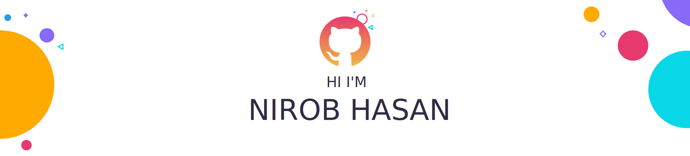

### Hi there 

I'm very passionate about new technologies 😎

- 🔭 I’m currently working on something cool 😉
- 🌱 I’m currently learning React Native, NodeJs, VFX 💻
- 💬 Ask me about C, PHP, Laravel, Java, JavaScript, React Native, NodeJs, LAMP 📱
- 📫 How to reach me: **papon.nirob@gmail.com**
- 🌍 Get know about me and some of my works from here []

Want to know more about me? [Check out my personal Website.](https://www.nirobhasan.com/)

## 💼 Skills

More Skills

 

 

 

<h3 align="left">Languages and Tools:</h3>

                   

 

## 📈 GitHub Stats

&nbsp;

  

